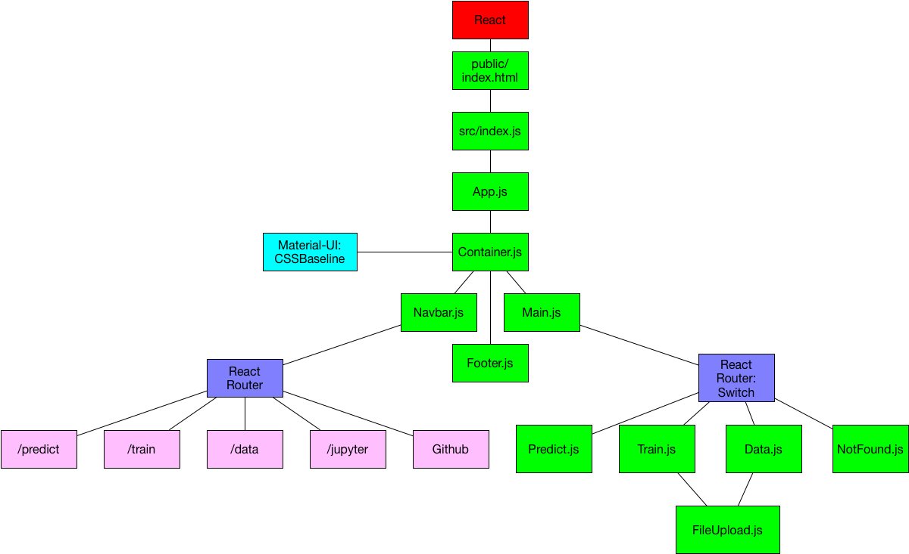
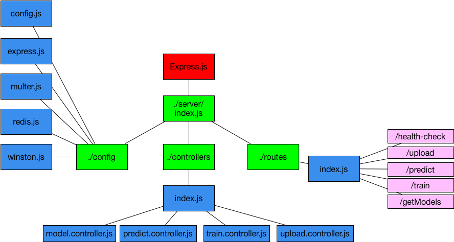
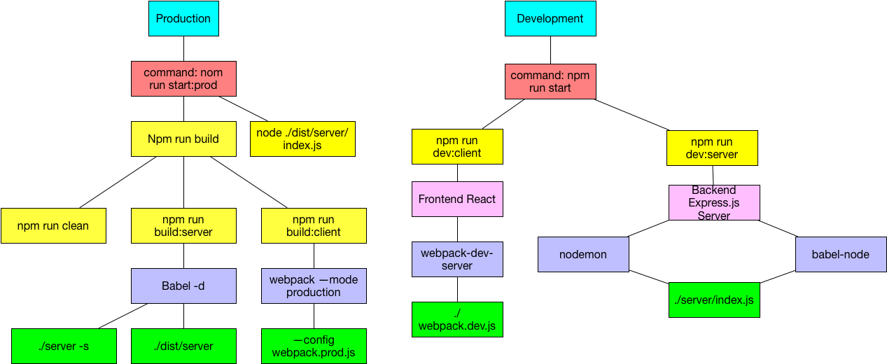

# react_interface
DeepCell graphical user interface built using React, Babel, Webpack. Run with `npm start` after git-cloning and npm-installing to run the app in development mode. Look into package.json for additional command-line accessible scripts. See section labeled "Front End Development/Production Commands Diagram"

# Front End React Hierarchy Diagram

The `App` Component in `/src` folder is the first parent Component that contains all other components. The `App` Component is directly referenced by the `index.js` file inside the `./src` folder. The `index.js` file is the entry point for Webpack (see `webpack.config.js` to bundle the app's data and serve it via `public/index.html` using a plugin called `HtmlWebpackPlugin`. The app also uses Babel via `.babelrc`, which is accessed within Webpack (press `Command + Shift + .` to be able to view invisible files in Mac Finder).

# Front End Express Hierarchy Diagram

# Front End Development/Production Commands Diagram

`Webpack.dev.js` is used for local development. `Webpack.prod.js` is the webpack config file that is used for production.

# Environment Variables Being Used
In production, the environment variables are passed in through Kubernetes. In local development, the developer should consult the `.env.example` file on the root directory to enter the appropriate information into a new `.env` file (which should be located on root). The Express.js server will then attempt to find a `.env` file by which to complete certain processes.
